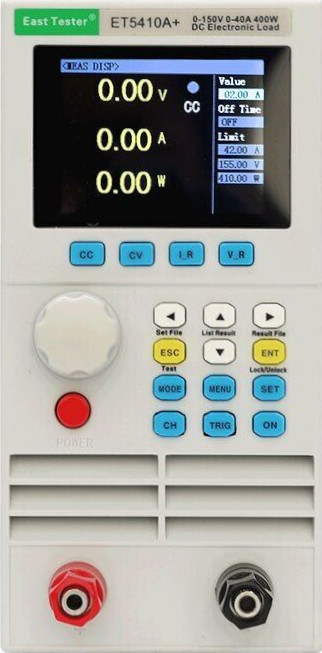

# ET54

Python class for remote controlling EastTester ET54 series electronic loads.

This *Should* work with all models of the ET54 series: ET5410, ET5411, ET5420,
ET5410A+, ET5411A+, ET5420A+, ET5406A+, ET5407A+



Sending raw SCPI commands to a device is cumbersome, so this class wraps all that into
a more approachable interface.

# In a Nutshell

Here is a little example script that illustrates how things work:

```{python}
#!/bin/env python3
import time, datetime
from ET54 import ET54

# connect to the load
el = ET54("ASRL/dev/ttyUSB1::INSTR")

# set ranges
el.ch1.Vrange = "high"
el.ch1.Crange = "high"

# set protections
el.ch1.OVP = 24.5
el.ch1.OCP = 4
el.ch1.OPP = 85

# start in constant current mode (3.1A)
el.ch1.CC_mode(3.1)
el.ch1.on()

# switch to CCCV mode
el.ch1.CCCV_mode(2.5, 13.5)
# and change the current on the way
el.ch1.CCCV_current = 1.25

# monitor voltage, current, power and resistance for a minute
print("timestamp, V, I, P, R")
for i in range(60):
    print(", ".join([str(x) for x in [
        datetime.datetime.now().strftime("%Y-%m-%d %H:%M:%S"),
        el.ch1.read_voltage(),
        el.ch1.read_current(),
        el.ch1.read_power(),
        el.ch1.read_resistance(),
    ]]))
    time.sleep(1)

# turn off the load channel
el.ch1.off()
```

# Status

[](https://github.com/nikku/works-on-my-machine)

So far, this has sucessfully been tested on the following devices:

* ET5410A+ (my device)
* ET5407A+ by PhracturedBlue

The other modles are expected to work but this is untested. If ou own one and are willing
to run a few tests, please get in touch.

Overall, this package needs more real world testing:

* in actual circuits (does the load really do what I think?)
* with all the different models of the series
* on Windows and MacOS (I use LINUX)

Most documented modes of operation and all measurements have been implemented.
Please note that not all models in the ET54 series support all of these modes.

| Feature                    | Status |
|--------------------------- |------- |
| Input on/off               | ✓      |
| Voltage and current ranges | ✓      |
| OCP, OVP, OPP              | ✓      |
| Trigger support            | ✓      |
| V/A/P/R readout            | ✓      |  
| CC mode                    | ✓      |
| CV mode                    | ✓      |
| CP mode                    | ✓      |
| CR mode                    | ✓      |
| CC+CV mode                 | ✓      |
| CC+CR mode                 | ✓      |
| Short mode                 | ✓      |  
| LED mode                   | ✓      |  
| Battery mode               | ✓      |  
| Transient mode             | ✓      |  
| List mode                  | ✓      |  
| SCAN mode                  | (✓)    |  
| Qualification test mode    | ✓      |  
| Load effect testing        | —      |
| File commands              | —      |
| System setup               | —      |


# Known issues

* SCAN mode is implemented but I don't understand, how to retrieve the result
  of the comparison. 
* Sometimes, the instrument takes a long time to respond which makes some tests
  fail randomly (typically `LIST_mode`).
* During `BATT_mode` tests, the device display looks weird at times.
* Display shows weird numbers when setting `TRANSIENT_width` values.

Some of these may be firmware quirks, others are probably my fault.


# Installation

1. Download the latest release package (` et54-XXX.tar.gz `) from github.
2. If you want to install in a virtual environment, first, create and activate it:
```
python -m venv .venv
source .venv/bin/activate
```
3. Install the package (replace *XXX* with the correct number)
```
python -m pip install et54-XXX.tar.gz
```


# Reference

The following sections give a tour of available functionality.  Detailed
api-documentation is given in the doc-strings of the classes. Use `pydoc` to
access it:

    python -m pydoc ET54
    python -m pydoc ET54.instrument
    python -m pydoc ET54.channel

For questions about valid values for all commands and general use of the
device, please refer to the manufacturers *user manual* and/or [*scpi
manual*](documents/ET54A+_SCPI.pdf).

## Connecting
    
This is how you connect to the load:

    from ET54 import ET54
    el = ET54("ASRL/dev/ttyUSB1::INSTR")

Or, on windows:

    from ET54 import ET54
    el = ET54("ASRL2::INSTR")

Of course, you need to adapt it to the right device for your case. See
[here](https://pyvisa.readthedocs.io/en/stable/introduction/names.html) for
details on pyvisa resource names.

## Instrument

The instrument instance provides the following methods.

    # sound a beep
    el.beep()
    
    # reset to default
    el.reset()

    # unlock the keypad
    # usually not advisable!
    el.unlock()
    # the next command will automatically lock again

    # send trigger event
    el.trigger()

    # turn all inputs on/off
    el.on()
    el.off()

    # query fan state
    el.fan()

    # Write SCPI command to connection and check status
    # e.g. set channel 1 CV mode voltage setting to 12.5V
    el.write("VOLT1:CV 12.5")
    
    # Write SCPI command to connection and return answer value
    # e.g. query channel 1 CV mode voltage setting
    el.query("VOLT1:CV?")

    # print device and status information
    print(el)


## Channels

The instrument object has one or two channels, depending on your model. Channel
objects can be accessed directly (`el.ch1`, `el.ch2`) or from the
channel list (`el.Channels[0]`).

Each channel provides lots of attributes and methods for configuring different
modes of operation, measuring etc.  All parameters that are part of the
configuration object are implemented as attributes and can be read and set just
like any other Python variable:

    my_OCP_value = el.ch1.OCP
    el.ch1.ocp = 12.8

There are a few exceptions that are read-only.

Measurements, on the other hand, are represented as functions (methods) that return
a measurement value when called. E.g.

    el.ch1.read_current()

Obviously, these cannot be set.


### Basic operation

    # Turn input on/off
    el.ch1.on()
    el.ch1.off()
    
    # or
    el.ch1.input = "ON"
    el.ch1.input = "OFF"

    # query input state
    print(el.ch1.input)

### Trigger setup

    # set manual trigger (*Trg* button on keypad)
    el.ch1.trigger_mode = "MAN"

    # set external trigger (connector at back of the instrument)
    el.ch1.trigger_mode = "EXT"

    # set software trigger (`el.trigger()`)
    el.ch1.trigger_mode = "TRG"

### Protection

The load provides configurable protection against over-current, over-voltage
and over-power. They can be set like this:

    el.ch1.OVP = 12.5
    el.ch1.OCP = 3.2
    el.ch1.OPP = 35

The values can also be queried:

    >>> el.ch1.OVP
    155.0
    >>> el.ch1.OCP
    42.0

Query the state of all protections (including no-configurable over-temperature
and reverse-polarity protection):

    >>> el.ch1.protection
    'NONE'


### Ranges

The device has two ranges (`HIGH`, `LOW`) for both voltage and current.

    el.ch1.Vrange = "high"
    el.ch1.Crange = "low"

    >>> el.ch1.Vrange
    "HIGH"


### Configuring modes of operation

There are two different ways to configure a mode:

1. Use the `mode` method and set all parameters separately
2. Use Individual `XXX_mode` configuration methods that take all parameters as
   arguments.

Example: configure CC mode

    el.ch1.CC_current = 2.5
    el.ch1.mode = "CC"

or

    el.ch1.CC_mode(2.5)

Both will have the same effect. Both allow changing any parameter after setup.

### Short mode

Short circuit mode takes no parameters.

    el.ch1.SHORT_mode()


### CC, CV, CR, CP

These modes take a single parameter that defines the desired current, voltage, resistance or power.

    # 3 A constant current
    el.ch1.CC_mode(3)

    # 12.5V constant voltage
    el.ch1.CV_mode(12.5)

    # 100 Ohm constant resistance
    el.ch1.CR_mode(100)

    # 50W constant power
    el.ch1.CP_mode(50)

Or set them up sequentially:

    # 3 A constant current
    el.ch1.CC_current = 3
    el.ch1.mode = "CC"

    # 12.5V constant voltage
    el.ch1.CV_voltage = 12.5
    el.ch1.mode = "CV"
    
    # 100 Ohm constant resistance
    el.ch1.CR_resistance = 100
    el.ch1.mode = "CR"

    # 50W constant power
    el.ch1.CP_power = 50
    el.ch1.mode = "CP"


### CCCV, CRCV

As the name suggests, these modes combine two of the basic modes and require
two parameters:

    el.ch1.CCCV_mode(current, voltage):
    el.ch1.CRCV_mode(resistance, voltage):

So here is how to call them:

    # 2.0A, 12.5V in CC+CV mode
    # all of these are equivalent:
    el.ch1.CCCV(2, 12.5)
    el.ch1.CCCV(current=2, voltage=12.5)
    el.ch1.CCCV(voltage=12.5, current=2)

    # CRCV 100 Ohm, 13.5V
    # all of these are equivalent:
    el.ch1.CRCV(100, 13.5)
    el.ch1.CRCV(resistance=100, voltage=13.5)

As you can see, you can eihter give all arguments in the correct order, or
explicitly use their names, in which case the order is not important.


### LED simulation mode

LED simulation mode is defined by three parameters: Current, Voltage and
Coefficient. See user mnaual for how these play together.

    el.ch1.LED_mode(V, I, coef)

Examples:

    el.ch1.LED_mode(V=8.1, I=0.8, coef=0.2)
or

    el.ch1.LED_voltage = 8.1
    el.ch1.LED_current = 0.8
    el.ch1.LED_coeff = 0.2
    el.ch1.mode = "LED"


### Battery test mode
    
Battery test mode accepts several parameters:

    el.ch1.BATT_mode(mode, value, cutoff, cutoff_value)

Battery mode supports two different operation (sub)modes (*CC* and *CR*)
and four cutoff conditions that govern when the load will turn off:

    mode:       {CC|CR}

    value:      current value [A] (CC mode)
                  or
                resistance value [Ω] (CR mode)

                If `cutoff == 'V'` AND `mode == 'CC'`:
                    list of up to 3 current values that
                    are set once the respective cutoff_value
                    has been reached.

    cutoff:     type of cutoff condition. One of

                V: voltage
                T: time
                E: energy
                C: capacity

    cutoff_value:
                Value(s) at which the load is turned off or switches to a
                different current.

                Most of the time, a single float defining the cutoff-value:

                    Voltage [V]
                    Time [s]
                    Energy [Wh]
                    Capacity [Ah]

                If  `cutoff == 'V'` AND `mode == 'CC'`:
                    A list of up to three voltage cutoffs that
                    trigger switching to the next current value once reached

                    E.g.:
                    value=[2.0, 1.5, 1.0]
                    cutoff_value=[15, 12, 10]

                    Level  Current     Voltage     Description
                    ---------------------------------------------------
                    3      2.0         15.0,       2.0A if V > 15.0V
                    2      1.5         12.0,       1.5A if V > 12.0V
                    1      1.0         10.0,       1.0A if V > 10.0V then off

Examples:

    el.ch1.BATT_mode(mode="CC", value=5.5, cutoff="Time", cutoff_value=5)
    el.ch1.BATT_mode(mode="CR", value=500, cutoff="Energy", cutoff_value=0.5)
    el.ch1.BATT_mode(mode="CC", value=(2.0, 1.5, 1.1), cutoff="Time", cutoff_value=(2.0, 1.5, 1.0))


### Transient mode
    
Transient mode needs four parameters:

    el.ch1.TRANSIENT_mode(mode, trigmode, value, width)

The load will switch between two states A and B depending on *mode*
and *trigmode*.

    mode:       sub-mode {CC|CV}
    trigmode:   trigger setting {CONT|COUT|TRIG|PULS}
                CONT is the smae as COUT. 
    value:      list/tuple of two values for transient states  
                in V or A, depending on *mode*
    width:      list/tupple of two pulse width values for the two states [s]

Examples:

    el.ch1.TRANSIENT_mode("CC", "CONT", (1, 3.8), (50,100))
    el.ch1.TRANSIENT_mode("CV", "PULS", [2.2, 8.1], [100, 200])
    el.ch1.TRANSIENT_mode("CC", "Trig", [3, 9.5], [500, 250])
    

### List mode

In list mode, the evice will stepp through a list of parameter sets. The
actual list is handed over in argument `params:`

    el.ch1.LIST_mode(stepmode, params)

Argument explanation:

    stepmode: mode for advancing in list {AUTO|TRIGGER}

    params: list/tuple of lists/tuples/dicts representing a row in the list:

        num     row number (1-10)
        mode    {CC|CV|CP|CR|OPEN|SHORT}
        value   value of current|voltage|poewr|resistance for respecive mode
        delay   time to spend in this row [s]
        comp    {OFF|CURRent|VOLTage|POWer|RESistance}
        maxval  upper limit for value
        minval  lower limit for value

Examples:

    # list parameters as list or tupple 
    param = [
                (1, "CC", 4.5, 30, "VOLTAGE", 15.0, 8.5),
                (2, "CV", 13.5, 60, "CURRENT", 1, 0.1),
                (3, "CV", 18.5, 45, "voltage", 2, 0.2),
                (4, "SHORT", 18.5, 45, "voltage", 1, 0.0),
            ]
    el.ch1-LIST_mode("Trigger", param)


    # list parameters as dict
    param = [
            { 
                "num": 1,
                "mode": "CV",
                "value": 11.0,
                "delay": 20,
                "comp": "RESISTANCE",
                "maxval": 13.0,
                "minval": 9.2,
            },
            {
                "num": 2,
                "mode": "CC",
                "value": 3.3,
                "delay": 690,
                "comp": "VOLTAGE",
                "maxval": 3.5,
                "minval": 3.0,
            },
        ]
    el.ch1-LIST_mode("AUTO", param)


### Scan mode

XXX: write me

    el.ch1.SCAN_mode(mode, threshold, threshold_value, compare, limits, start_end, step, step_time)

### Qualification testing

XXX: write me

    el.ch1.QUALI_mode(Vrange, Crange, Prange)


### Load effect testing

XXX – not implemented, yet

## Reading data

Once the load is set up, you can start reading measurement data
from it. In contrast to parameters, measurements are implemented as `read_`
methods. There are four quantities you can measure:

    V = el.ch1.read_voltage()
    I = el.ch1.read_current()
    P = el.ch1.read_power()
    R = el.ch1.read_resistance()


# Trouble shooting

The SCPI implementation in the instrument is a bit wonky. I spent a lot of time
figuring out some peculiarities and have managed to fully crash the controller
many times. Many of these problems had to do with timing (some commands are
fast, others require some time before you may send a new command). The SCPI
documentation by the manufacturer is a bit obscure and incomplete in some places.

It is quite possible that different models and/or firmware or hardware
revisions behave slightly different than my instrument. If you encounter
problems, you can try tweaking a few parameters:

| parameter  | Description                                               |
|----------  |---------------------------------------------------------  |
| `baudrate` | must match baudrate set in device (default: 9600)         |
| `eol_r`    | line terminator for reading from device (default: "\r\n") |
| `eol_w`    | line terminator for writing to device (default: "\n")     |
| `delay`    | delay after read/write operation [s] (default: 0.2)       |
| `timeout`  | timeout [ms] before giving up on `read` requests (default: 1000) |
| `model`    | model ID [ET5410/ET5420/ET541A+/...] <br> only required if `*IDN?` does not return a valid ID e.g. for Mustool branded ET5410A+ |

The most likely candidate to fix weird problems is `delay`. The device manual
does not specify what command frequency or processing time the instrument has
so I used the smallest value that allowed all my test cases to pass. I also
asked ET support about it and the answer was "The time interval should be above
200ms" which matches my own observations, but your mileage may vary.

Example:

    el = ET54("ASRL/dev/ttyUSB0", delay=0.5, baudrate=14400)


## Talking to the device directly

If you want to play with the device on raw metal and try some SCPI commands
yourself, you can connect to it like so

    tio -e -b 9600 -m INLCRNL,OCRNL /dev/ttyUSB0

You can use other programs like minicom etc. Just make sure to get the weirdly
inconsistent line terminators right.

*Caution:* The device uses an internal usb2serial device (*QinHeng Electronics
CH340 serial converter*) which is detected by the operation system even if the
load is turned off. There is nothing I can do about that. Obviously, you cannot
talk to the device in that state. 


## Mustool branded devices

There are *Mustool* branded versions of the ET5410A+ and possibly also of the
other models. These devices run a modified firmware and return an unhelpful
model ID (`xxxxxx`) in response to the `*IDN?` SCPI command. To make these
devices work, you need to explicitly provide the model ID when initializing the
device:

    from ET54 import ET54
    el = ET54("ASRL/dev/ttyUSB0", model="ET5410A+")


# Contributing

If you think you found a bug or you have an idea for a new feature, please open
an issue here on GitHub. Please **do not submit pull-requests before discussing
the issue** you want to address.

If you want to report a bug, please make sure to replicate the erroneous
behavior at least once before opening an issue and provide all information
necessary to replicate the problem (what commands did you use, what was
connected to the load, what did you observe, what did you expect?).

I would very much appreciate help from people who own any of the various models
listed above: It would be great if they could run the automated tests on their
devices and let me know if that went fine or produced errors. Please get in
touch if you would like to do that. Also any feedback and bug reports are
welcome.

